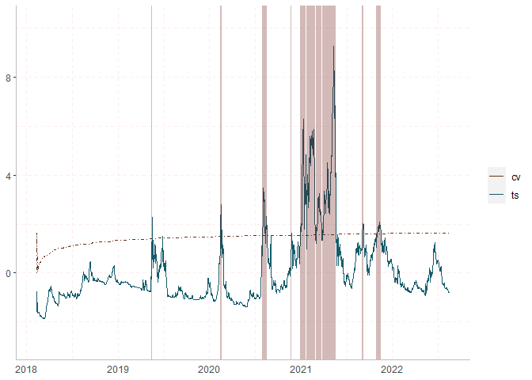

R Notebook
================

``` r
#load packages
library("exuber")
library("dplyr")
```

    ## Warning: Paket 'dplyr' wurde unter R Version 4.2.1 erstellt

    ## 
    ## Attache Paket: 'dplyr'

    ## Die folgenden Objekte sind maskiert von 'package:stats':
    ## 
    ##     filter, lag

    ## Die folgenden Objekte sind maskiert von 'package:base':
    ## 
    ##     intersect, setdiff, setequal, union

``` r
library("ggplot2")
library("tidyr")
library("plotly")
```

    ## 
    ## Attache Paket: 'plotly'

    ## Das folgende Objekt ist maskiert 'package:ggplot2':
    ## 
    ##     last_plot

    ## Das folgende Objekt ist maskiert 'package:stats':
    ## 
    ##     filter

    ## Das folgende Objekt ist maskiert 'package:graphics':
    ## 
    ##     layout

``` r
library("readr")
library("readxl")
```

    ## Warning: Paket 'readxl' wurde unter R Version 4.2.1 erstellt

``` r
library("lubridate")
```

    ## 
    ## Attache Paket: 'lubridate'

    ## Die folgenden Objekte sind maskiert von 'package:base':
    ## 
    ##     date, intersect, setdiff, union

``` r
Bitcoin <- data.frame(read_csv("../Data/Crypto/Bitcoin.csv"))
```

    ## Rows: 1690 Columns: 7
    ## ── Column specification ────────────────────────────────────────────────────────
    ## Delimiter: ","
    ## chr (3): Date, Vol., Change %
    ## 
    ## ℹ Use `spec()` to retrieve the full column specification for this data.
    ## ℹ Specify the column types or set `show_col_types = FALSE` to quiet this message.

``` r
Ethereum <- data.frame(read_csv("../Data/Crypto/Ethereum.csv"))
```

    ## Rows: 1743 Columns: 7
    ## ── Column specification ────────────────────────────────────────────────────────
    ## Delimiter: ","
    ## dbl  (6): Open, High, Low, Close, Adj Close, Volume
    ## date (1): Date
    ## 
    ## ℹ Use `spec()` to retrieve the full column specification for this data.
    ## ℹ Specify the column types or set `show_col_types = FALSE` to quiet this message.

``` r
date_column <- seq(from = as.Date("2018-01-01"), to = as.Date("2022-08-17"), by = 'day')
date_column <- date_column[order(date_column,decreasing=TRUE)]
Bitcoin$Date <- date_column
Bitcoin <- Bitcoin[order(Bitcoin$Date),]
Bitcoin <- subset(Bitcoin, select = c(Date,Open))
Ethereum <- subset(Ethereum, select = c(Date,Close))
```

``` r
colnames(Bitcoin)[1] <- "DateTime"
colnames(Bitcoin)[2] <- "avg_usd"
colnames(Ethereum)[1] <- "DateTime"
colnames(Ethereum)[2] <- "avg_usd"
```

``` r
#convert data --> avg.USD
get_avg_usd <- function(df) {
  df$avg_usd <- ifelse(df[,2]==0, 0, round(df[,3]/df[,2],2))
  return(df)
}

#check dataframe for null values
get_last_zero <- function(df) {
  max_date <- subset(df,avg_usd == 0) %>% tail(n=1)
  if(nrow(max_date) == 0){
    return(NULL)
  } else {
    return(max_date$DateTime[1])
  }
}
```

``` r
#set test parameters
lag_t <- 1
significance_lvl <- 95
#put time series into list to perform functions
names <- list("Bitcoin","Ethereum")
data <- list(Bitcoin,Ethereum)
```

``` r
#data <- lapply(data,get_avg_usd)
date_list <- lapply(data,get_last_zero)
```

``` r
#subset Data to have non null values in dataset
i <- 1
data_sub <- list()

for (x in data){
  
  if(!is.null(date_list[[i]])){
    x <- subset(x, DateTime >= date_list[[i]])
    data_sub[[i]] <- x
    } else{
    data_sub[[i]] <- x
  }
  i <- i + 1
}
```

``` r
# get time series info
starting <- list()
ending <- list()

for (x in data_sub){
    s <- min(x$DateTime)
    e <- max(x$DateTime)
    s <- format(s,format="%Y-%m-%d")
    e <- format(e,format="%Y-%m-%d")
    starting <- append(starting,s)
    ending <- append(ending,e)
}

time_frames <- data.frame(unlist(starting), unlist(ending))
```

``` r
#gsadf tests on data with time stamps and summaries
test_results <- lapply(data_sub, radf, lag = lag_t)
```

    ## Using `DateTime` as index variable.
    ## Using `DateTime` as index variable.

``` r
test_summary <- lapply(test_results, summary)
```

    ## Using `exuberdata::radf_crit2` for `cv`.

    ## Using `exuberdata::radf_crit2` for `cv`.

``` r
test_datestamps <- lapply(test_results,datestamp,sig_lvl = significance_lvl, lag = lag_t, nonrejected = TRUE)
```

    ## Using `exuberdata::radf_crit2` for `cv`.
    ## Using `exuberdata::radf_crit2` for `cv`.

``` r
help(radf_crit)
```

    ## starte den http Server für die Hilfe fertig

``` r
lapply(test_results,autoplot,sig_lvl = significance_lvl, option = "gsadf", nonrejected = TRUE)
```

    ## Using `exuberdata::radf_crit2` for `cv`.
    ## Using `exuberdata::radf_crit2` for `cv`.

    ## [[1]]

<!-- -->

    ## 
    ## [[2]]

<!-- -->

``` r
# get number of rows of dataframes to extract critical values from exuber package
n_rows <- lapply(data_sub,nrow)
```

``` r
# get critical value sequences for data from exuber package

cvs <- list()
for (x in n_rows) {
  if (x<600){
    y <- radf_crit[x-lag_t]
    cvs <- append(cvs,y)
    } else{
    y <-exuberdata::radf_crit2[x-lag_t]
    cvs <- append(cvs,y)
  }
}
```

``` r
#calculate minimal window to create date sequence in next step
get_w_m <- function(obs){
  r_0 <- 0.01 + (1.8/sqrt(obs))
  length <- r_0*obs
  return(round(length))
}
```

``` r
# create datesequence for graphs
date_seq_list <- list()
# Subtract minimum window length from start date and create data sequence 
for (x in 1:length(data_sub)) {
  len <- as.difftime(n_rows[[x]], unit="days") - get_w_m(n_rows[[x]]) - lag_t
  date <- tail(data_sub[[x]],n=1)$DateTime - (len - 1)
  date_seq <- seq(date, by = "day", length.out = len)
  date_seq <- list(format(date_seq,foramt = "%Y-%m-%d"))
  date_seq_list <- append(date_seq_list,date_seq)
}
```

``` r
#create dfs for plots
plot_dfs <- list()

for (x in 1:length(data_sub)){
  y <- cbind(date_seq_list[[x]],test_results[[x]]$bsadf,cvs[[x]]$bsadf_cv)
  y <- as.data.frame(y)
  plot_dfs <- append(plot_dfs,list(y))
}
```

    ## Warning in cbind(date_seq_list[[x]], test_results[[x]]$bsadf, cvs[[x]]
    ## $bsadf_cv): number of rows of result is not a multiple of vector length (arg 1)

    ## Warning in cbind(date_seq_list[[x]], test_results[[x]]$bsadf, cvs[[x]]
    ## $bsadf_cv): number of rows of result is not a multiple of vector length (arg 1)

``` r
for (x in 1:length(plot_dfs)) {
  plot_dfs[[x]]$date <- as.Date(plot_dfs[[x]]$V1)
  plot_dfs[[x]] <- subset(plot_dfs[[x]],select = -c(1))
  plot_dfs[[x]][,1:4] <- sapply(plot_dfs[[x]][,1:4], as.numeric)
  colnames(plot_dfs[[x]]) <- c('bsadf','low','middle','high','date')
}
```

``` r
# function to get data into form for plot, standard significance level to 95
plot_prep <- function(n,sig=95) {
  
  x <- 3
  
  if(sig == 90){
    x <- 2
  }else if (sig == 95){
    x <- 3
  }else {
    x <- 4
  }
  
  variable1 <- rep(c("bsadf"),times=nrow(plot_dfs[[n]][1]))
  bsadf_data <- cbind(plot_dfs[[n]][5],plot_dfs[[n]][1],variable1)
  colnames(bsadf_data) <- c('date','value','variable')
  
  variable2 <- rep(c(paste(as.character(sig),"%",sep="")),times=nrow(plot_dfs[[n]][x]))
  cv_data <-cbind(plot_dfs[[n]][5],plot_dfs[[n]][x],variable2)
  colnames(cv_data) <- c('date','value','variable')
  data <- rbind(bsadf_data, cv_data)
  return(data)
}
```

``` r
# apply plot preparation function of previous step to plot dfs
plot_list <- list()
for (x in 1:length(plot_dfs)){
  data <- plot_prep(x,sig = significance_lvl)
  plot_list <- append(plot_list,list(data))
}
```

``` r
line_width <- 0.3

for (x in 1:length(plot_list)){
  start_date <- test_datestamps[[x]]$avg_usd$Start
  end_date <- test_datestamps[[x]]$avg_usd$End
  recession <- data.frame(date_start= as_date(start_date),
                        date_end = as_date(end_date))
  
  
  if (nrow(recession)>0){
  plt <- ggplot()+ 
            geom_line(data = plot_list[[x]], aes(x = date, y = value, color = variable, linetype = variable), size = line_width) +
            ylim(min(plot_list[[x]]$value)-1,max(plot_list[[x]]$value)+1)+
            #labs(title=names[x]) +  # title and caption
            scale_colour_manual(label=c('cv','ts'),
                             values = c("#6b2d13", "#135c6b")) +
            scale_linetype_manual(values = c("dotdash","solid")) + 
            guides(linetype = "none") +
            theme(
              axis.title.y=element_blank(),
              axis.title.x=element_blank(),
              axis.ticks.x=element_blank(),
              axis.line.x.bottom = element_line(color = 'grey'),
              axis.line.y.left   = element_line(color = 'grey'),
              panel.grid = element_line(color = "#FDEDEC",
                                        size = 0.5,
                                        linetype = 2),
              panel.background = element_rect(fill = "white"),
              legend.title = element_blank()
              )+
            geom_rect(data = recession, aes(xmin = date_start, xmax = date_end, ymin = -Inf, ymax = Inf),
                    fill = "#6b1713", alpha= 0.3,show.legend = FALSE)
    print(plt)
    ggsave(plt, path = "../Figs", file = paste0("bsadf_", names[x],".png"), width = 14, height = 10, units = "cm")}
  else{
  plt <- ggplot()+ 
            geom_line(data = plot_list[[x]], aes(x = date, y = value, color = variable, linetype = variable), size = line_width) +
            ylim(min(plot_list[[x]]$value)-1,max(plot_list[[x]]$value)+1)+
            labs(title=names[x]) +  # title and caption
            scale_colour_manual(label=c('cv','ts'),
                             values = c("#6b2d13", "#135c6b")) +
            scale_linetype_manual(values = c("dotdash","solid")) + 
            guides(linetype = "none") +
            theme(
              axis.title.y=element_blank(),
              axis.title.x=element_blank(),
              axis.ticks.x=element_blank(),
              axis.line.x.bottom = element_line(color = 'grey'),
              axis.line.y.left   = element_line(color = 'grey'),
              panel.grid = element_line(color = "#FDEDEC",
                                        size = 0.5,
                                        linetype = 2),
              panel.background = element_rect(fill = "white"),
              legend.title = element_blank()
              )
    print(plt)
    ggsave(plt, path = "../Figs", file = paste0("bsadf_", names[x],".png"), width = 14, height = 10, units = "cm")}
  }
```

<!-- --><!-- -->

``` r
print(test_summary)
```

    ## [[1]]
    ## 
    ## ── Summary (minw = 90, lag = 1) ─────────────────── Monte Carlo (nrep = 2000) ──
    ## 
    ## avg_usd :
    ## # A tibble: 3 × 5
    ##   stat  tstat   `90`   `95`  `99`
    ##   <fct> <dbl>  <dbl>  <dbl> <dbl>
    ## 1 adf   -1.19 -0.380 0.0200 0.805
    ## 2 sadf   6.97  1.35  1.64   2.13 
    ## 3 gsadf  8.38  2.22  2.42   2.89 
    ## 
    ## 
    ## [[2]]
    ## 
    ## ── Summary (minw = 92, lag = 1) ─────────────────── Monte Carlo (nrep = 2000) ──
    ## 
    ## avg_usd :
    ## # A tibble: 3 × 5
    ##   stat  tstat   `90`   `95`  `99`
    ##   <fct> <dbl>  <dbl>  <dbl> <dbl>
    ## 1 adf   -1.29 -0.383 0.0609 0.784
    ## 2 sadf   7.52  1.35  1.64   2.13 
    ## 3 gsadf  9.26  2.23  2.43   2.92

``` r
for (x in 1:length(test_datestamps)){
  print(names[x])
  print(data.frame(test_datestamps[[x]]))
}
```

    ## [[1]]
    ## [1] "Bitcoin"
    ## 
    ##    avg_usd.Start avg_usd.Peak avg_usd.End avg_usd.Duration avg_usd.Signal
    ## 1     2018-11-25   2018-11-25  2018-11-29                4       positive
    ## 2     2019-04-09   2019-04-09  2019-04-10                1       positive
    ## 3     2019-05-10   2019-05-16  2019-05-19                9       positive
    ## 4     2019-05-20   2019-05-28  2019-06-04               15       positive
    ## 5     2019-06-18   2019-06-18  2019-06-19                1       positive
    ## 6     2019-06-20   2019-06-27  2019-07-02               12       positive
    ## 7     2019-07-04   2019-07-04  2019-07-06                2       positive
    ## 8     2019-07-09   2019-07-10  2019-07-12                3       positive
    ## 9     2020-11-06   2020-11-07  2020-11-08                2       negative
    ## 10    2020-11-13   2020-11-14  2020-11-15                2       positive
    ## 11    2020-11-17   2020-11-21  2020-11-27               10       positive
    ## 12    2020-12-01   2020-12-01  2020-12-02                1       positive
    ## 13    2020-12-03   2020-12-04  2020-12-05                2       positive
    ## 14    2020-12-17   2021-01-09  2021-01-22               36       positive
    ## 15    2021-01-23   2021-01-23  2021-01-28                5       positive
    ## 16    2021-01-29   2021-02-22  2021-04-24               85       positive
    ## 17    2021-04-27   2021-05-09  2021-05-13               16       positive
    ##    avg_usd.Ongoing avg_usd.Nonrejected
    ## 1            FALSE               FALSE
    ## 2            FALSE               FALSE
    ## 3            FALSE               FALSE
    ## 4            FALSE               FALSE
    ## 5            FALSE               FALSE
    ## 6            FALSE               FALSE
    ## 7            FALSE               FALSE
    ## 8            FALSE               FALSE
    ## 9            FALSE               FALSE
    ## 10           FALSE               FALSE
    ## 11           FALSE               FALSE
    ## 12           FALSE               FALSE
    ## 13           FALSE               FALSE
    ## 14           FALSE               FALSE
    ## 15           FALSE               FALSE
    ## 16           FALSE               FALSE
    ## 17           FALSE               FALSE
    ## [[1]]
    ## [1] "Ethereum"
    ## 
    ##    avg_usd.Start avg_usd.Peak avg_usd.End avg_usd.Duration avg_usd.Signal
    ## 1     2019-05-15   2019-05-16  2019-05-17                2       positive
    ## 2     2019-06-26   2019-06-26  2019-06-27                1       positive
    ## 3     2020-02-12   2020-02-14  2020-02-16                4       positive
    ## 4     2020-02-18   2020-02-18  2020-02-19                1       positive
    ## 5     2020-07-30   2020-08-01  2020-08-11               12       positive
    ## 6     2020-08-13   2020-08-14  2020-08-18                5       positive
    ## 7     2020-11-23   2020-11-23  2020-11-25                2       positive
    ## 8     2020-12-28   2021-01-09  2021-01-21               24       positive
    ## 9     2021-01-22   2021-02-19  2021-02-26               35       positive
    ## 10    2021-03-01   2021-03-01  2021-03-02                1       positive
    ## 11    2021-03-03   2021-03-13  2021-03-24               21       positive
    ## 12    2021-03-26   2021-05-11  2021-05-19               54       positive
    ## 13    2021-05-20   2021-05-20  2021-05-21                1       positive
    ## 14    2021-09-01   2021-09-05  2021-09-07                6       positive
    ## 15    2021-10-29   2021-10-29  2021-10-30                1       positive
    ## 16    2021-11-02   2021-11-08  2021-11-16               14       positive
    ##    avg_usd.Ongoing avg_usd.Nonrejected
    ## 1            FALSE               FALSE
    ## 2            FALSE               FALSE
    ## 3            FALSE               FALSE
    ## 4            FALSE               FALSE
    ## 5            FALSE               FALSE
    ## 6            FALSE               FALSE
    ## 7            FALSE               FALSE
    ## 8            FALSE               FALSE
    ## 9            FALSE               FALSE
    ## 10           FALSE               FALSE
    ## 11           FALSE               FALSE
    ## 12           FALSE               FALSE
    ## 13           FALSE               FALSE
    ## 14           FALSE               FALSE
    ## 15           FALSE               FALSE
    ## 16           FALSE               FALSE

``` r
#function to create table
rslt <- function(list,tf,nombres) {
  
  len_df <- length(list)
  df_return <- list[[1]]$avg_usd[3,]

  for (x in 2:len_df){
    v1 <- list[[x]]$avg_usd[3,]
    df_return <- rbind(df_return,v1)
  }
  df_return <- cbind(unlist(nombres),tf,df_return)
  return(df_return)
}
```

``` r
result_table <- rslt(test_summary,time_frames,names) 
print(result_table)
```

    ##   unlist(nombres) unlist.starting. unlist.ending.  stat    tstat       90
    ## 1         Bitcoin       2018-01-01     2022-08-17 gsadf 8.378623 2.218818
    ## 2        Ethereum       2017-11-09     2022-08-17 gsadf 9.261933 2.229613
    ##         95       99
    ## 1 2.416065 2.893946
    ## 2 2.427113 2.919156

``` r
for (x in 1:length(test_datestamps)){
  print(names[x])
  print(data.frame(test_datestamps[[x]]))
}
```

    ## [[1]]
    ## [1] "Bitcoin"
    ## 
    ##    avg_usd.Start avg_usd.Peak avg_usd.End avg_usd.Duration avg_usd.Signal
    ## 1     2018-11-25   2018-11-25  2018-11-29                4       positive
    ## 2     2019-04-09   2019-04-09  2019-04-10                1       positive
    ## 3     2019-05-10   2019-05-16  2019-05-19                9       positive
    ## 4     2019-05-20   2019-05-28  2019-06-04               15       positive
    ## 5     2019-06-18   2019-06-18  2019-06-19                1       positive
    ## 6     2019-06-20   2019-06-27  2019-07-02               12       positive
    ## 7     2019-07-04   2019-07-04  2019-07-06                2       positive
    ## 8     2019-07-09   2019-07-10  2019-07-12                3       positive
    ## 9     2020-11-06   2020-11-07  2020-11-08                2       negative
    ## 10    2020-11-13   2020-11-14  2020-11-15                2       positive
    ## 11    2020-11-17   2020-11-21  2020-11-27               10       positive
    ## 12    2020-12-01   2020-12-01  2020-12-02                1       positive
    ## 13    2020-12-03   2020-12-04  2020-12-05                2       positive
    ## 14    2020-12-17   2021-01-09  2021-01-22               36       positive
    ## 15    2021-01-23   2021-01-23  2021-01-28                5       positive
    ## 16    2021-01-29   2021-02-22  2021-04-24               85       positive
    ## 17    2021-04-27   2021-05-09  2021-05-13               16       positive
    ##    avg_usd.Ongoing avg_usd.Nonrejected
    ## 1            FALSE               FALSE
    ## 2            FALSE               FALSE
    ## 3            FALSE               FALSE
    ## 4            FALSE               FALSE
    ## 5            FALSE               FALSE
    ## 6            FALSE               FALSE
    ## 7            FALSE               FALSE
    ## 8            FALSE               FALSE
    ## 9            FALSE               FALSE
    ## 10           FALSE               FALSE
    ## 11           FALSE               FALSE
    ## 12           FALSE               FALSE
    ## 13           FALSE               FALSE
    ## 14           FALSE               FALSE
    ## 15           FALSE               FALSE
    ## 16           FALSE               FALSE
    ## 17           FALSE               FALSE
    ## [[1]]
    ## [1] "Ethereum"
    ## 
    ##    avg_usd.Start avg_usd.Peak avg_usd.End avg_usd.Duration avg_usd.Signal
    ## 1     2019-05-15   2019-05-16  2019-05-17                2       positive
    ## 2     2019-06-26   2019-06-26  2019-06-27                1       positive
    ## 3     2020-02-12   2020-02-14  2020-02-16                4       positive
    ## 4     2020-02-18   2020-02-18  2020-02-19                1       positive
    ## 5     2020-07-30   2020-08-01  2020-08-11               12       positive
    ## 6     2020-08-13   2020-08-14  2020-08-18                5       positive
    ## 7     2020-11-23   2020-11-23  2020-11-25                2       positive
    ## 8     2020-12-28   2021-01-09  2021-01-21               24       positive
    ## 9     2021-01-22   2021-02-19  2021-02-26               35       positive
    ## 10    2021-03-01   2021-03-01  2021-03-02                1       positive
    ## 11    2021-03-03   2021-03-13  2021-03-24               21       positive
    ## 12    2021-03-26   2021-05-11  2021-05-19               54       positive
    ## 13    2021-05-20   2021-05-20  2021-05-21                1       positive
    ## 14    2021-09-01   2021-09-05  2021-09-07                6       positive
    ## 15    2021-10-29   2021-10-29  2021-10-30                1       positive
    ## 16    2021-11-02   2021-11-08  2021-11-16               14       positive
    ##    avg_usd.Ongoing avg_usd.Nonrejected
    ## 1            FALSE               FALSE
    ## 2            FALSE               FALSE
    ## 3            FALSE               FALSE
    ## 4            FALSE               FALSE
    ## 5            FALSE               FALSE
    ## 6            FALSE               FALSE
    ## 7            FALSE               FALSE
    ## 8            FALSE               FALSE
    ## 9            FALSE               FALSE
    ## 10           FALSE               FALSE
    ## 11           FALSE               FALSE
    ## 12           FALSE               FALSE
    ## 13           FALSE               FALSE
    ## 14           FALSE               FALSE
    ## 15           FALSE               FALSE
    ## 16           FALSE               FALSE
