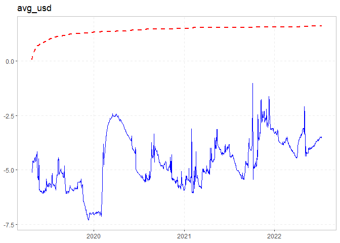
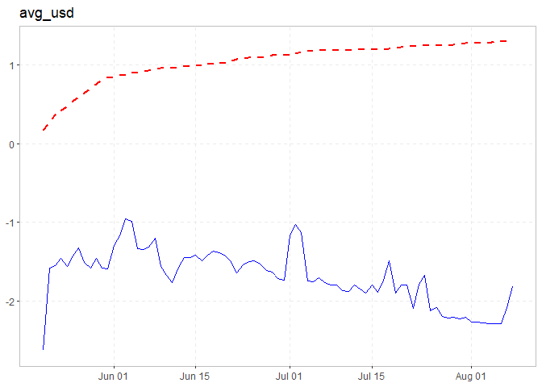
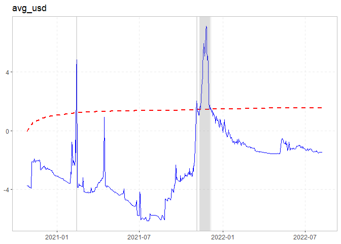
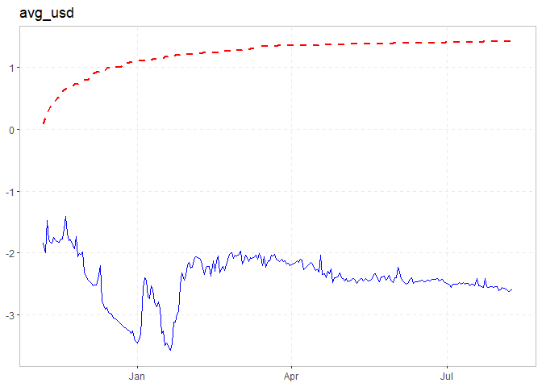
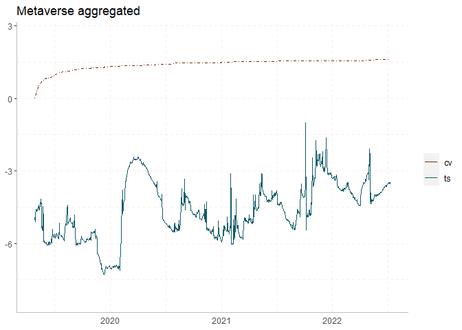
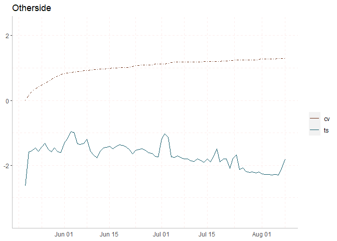
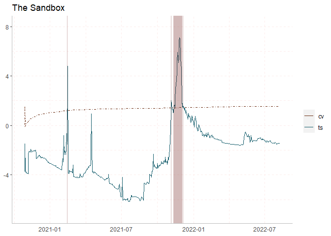
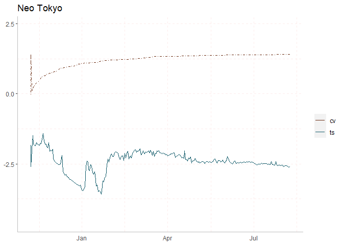

R Notebook
================
Dominik Wulf
06 September, 2022

``` r
#load packages
library("exuber")
library("dplyr")
```

    ## Warning: Paket 'dplyr' wurde unter R Version 4.2.1 erstellt

    ## 
    ## Attache Paket: 'dplyr'

    ## Die folgenden Objekte sind maskiert von 'package:stats':
    ## 
    ##     filter, lag

    ## Die folgenden Objekte sind maskiert von 'package:base':
    ## 
    ##     intersect, setdiff, setequal, union

``` r
library("ggplot2")
library("tidyr")
library("readr")
library("readxl")
```

    ## Warning: Paket 'readxl' wurde unter R Version 4.2.1 erstellt

``` r
library("lubridate")
```

    ## 
    ## Attache Paket: 'lubridate'

    ## Die folgenden Objekte sind maskiert von 'package:base':
    ## 
    ##     date, intersect, setdiff, union

``` r
#load files
Metaverse_agg <- data.frame(read_csv("../Data/Metaverse/220711_Metaverse.csv"))
```

    ## Rows: 1747 Columns: 3
    ## ── Column specification ────────────────────────────────────────────────────────
    ## Delimiter: ","
    ## dbl  (2): Number of sales, Sales USD
    ## dttm (1): DateTime
    ## 
    ## ℹ Use `spec()` to retrieve the full column specification for this data.
    ## ℹ Specify the column types or set `show_col_types = FALSE` to quiet this message.

``` r
Otherside <- data.frame(read_csv("../Data/Metaverse/220808_otherside.csv"))
```

    ## Rows: 103 Columns: 3
    ## ── Column specification ────────────────────────────────────────────────────────
    ## Delimiter: ","
    ## dbl  (2): Number of sales, Sales USD
    ## dttm (1): DateTime
    ## 
    ## ℹ Use `spec()` to retrieve the full column specification for this data.
    ## ℹ Specify the column types or set `show_col_types = FALSE` to quiet this message.

``` r
Sandbox <- data.frame(read_csv("../Data/Metaverse/220808_sandbox.csv"))
```

    ## Rows: 981 Columns: 3
    ## ── Column specification ────────────────────────────────────────────────────────
    ## Delimiter: ","
    ## dbl  (2): Number of sales, Sales USD
    ## dttm (1): DateTime
    ## 
    ## ℹ Use `spec()` to retrieve the full column specification for this data.
    ## ℹ Specify the column types or set `show_col_types = FALSE` to quiet this message.

``` r
neotokyo <- data.frame(read_csv("../Data/Metaverse/220808_neotokyo.csv"))
```

    ## Rows: 310 Columns: 3
    ## ── Column specification ────────────────────────────────────────────────────────
    ## Delimiter: ","
    ## dbl  (2): Number of sales, Sales USD
    ## dttm (1): DateTime
    ## 
    ## ℹ Use `spec()` to retrieve the full column specification for this data.
    ## ℹ Specify the column types or set `show_col_types = FALSE` to quiet this message.

``` r
#calculate data --> avg.USD
get_avg_usd <- function(df) {
  df$avg_usd <- ifelse(df[,2]==0, 0, round(df[,3]/df[,2],2))
  return(df)
}

#check dataframe for null values
get_last_zero <- function(df) {
  max_date <- subset(df,avg_usd == 0) %>% tail(n=1)
  if(nrow(max_date) == 0){
    return(NULL)
  } else {
    return(max_date$DateTime[1])
  }
}
```

``` r
#set GSADF model parameters
lag_t <- 1
significance_lvl <- 95
#create list for time series to apply functions
names <- list("Metaverse aggregated","Otherside","The Sandbox","Neo Tokyo")
data <- list(Metaverse_agg,Otherside,Sandbox,neotokyo)
```

``` r
data <- lapply(data,get_avg_usd)
date_list <- lapply(data,get_last_zero)
```

``` r
#subset Data to have non null values in dataset
i <- 1
data_sub <- list()

for (x in data){
  
  if(!is.null(date_list[[i]])){
    x <- subset(x, DateTime >= date_list[[i]])
    data_sub[[i]] <- x
    } else{
    data_sub[[i]] <- x
  }
  i <- i + 1
}
```

``` r
#subset data to only carry date and avg_usd column
i <- 1
for (x in data_sub){
  x <- x[-c(2,3)]
  data_sub[[i]] <- x
  i <- i + 1
  }
```

``` r
# get time series info
starting <- list()
ending <- list()

for (x in data_sub){
    s <- min(x$DateTime)
    e <- max(x$DateTime)
    s <- format(s,format="%Y-%m-%d")
    e <- format(e,format="%Y-%m-%d")
    starting <- append(starting,s)
    ending <- append(ending,e)
}

time_frames <- data.frame(unlist(starting), unlist(ending))
```

``` r
#gsadf tests on data with time stamps and summaries
test_results <- lapply(data_sub, radf, lag = lag_t)
```

    ## Using `DateTime` as index variable.
    ## Using `DateTime` as index variable.
    ## Using `DateTime` as index variable.
    ## Using `DateTime` as index variable.

``` r
test_summary <- lapply(test_results, summary)
```

    ## Using `exuberdata::radf_crit2` for `cv`.

    ## Using `radf_crit` for `cv`.

    ## Using `exuberdata::radf_crit2` for `cv`.

    ## Using `radf_crit` for `cv`.

``` r
test_datestamps <- lapply(test_results,datestamp,sig_lvl = significance_lvl, lag = lag_t, nonrejected = TRUE)
```

    ## Using `exuberdata::radf_crit2` for `cv`.

    ## Warning: Argument 'min_duration' excludes all explosive periods

    ## Using `radf_crit` for `cv`.

    ## Warning: Argument 'min_duration' excludes all explosive periods

    ## Using `exuberdata::radf_crit2` for `cv`.
    ## Using `radf_crit` for `cv`.

    ## Warning: Argument 'min_duration' excludes all explosive periods

``` r
#apply BSADF test on time series
lapply(test_results,autoplot,sig_lvl = significance_lvl, option = "gsadf", nonrejected = TRUE)
```

    ## Using `exuberdata::radf_crit2` for `cv`.

    ## Using `radf_crit` for `cv`.

    ## Using `exuberdata::radf_crit2` for `cv`.

    ## Using `radf_crit` for `cv`.

    ## [[1]]

<!-- -->

    ## 
    ## [[2]]

<!-- -->

    ## 
    ## [[3]]

<!-- -->

    ## 
    ## [[4]]

<!-- -->

``` r
# get number of rows of dataframes to extract critical values from exuber package
n_rows <- lapply(data_sub,nrow)
```

``` r
# get critical value sequences for data from exuber package

cvs <- list()
for (x in n_rows) {
  if (x<600){
    y <- radf_crit[x-lag_t]
    cvs <- append(cvs,y)
    } else{
    y <-exuberdata::radf_crit2[x-lag_t]
    cvs <- append(cvs,y)
  }
}
```

``` r
#calculate minimal window to create date sequence in next step
get_w_m <- function(obs){
  r_0 <- 0.01 + (1.8/sqrt(obs))
  length <- r_0*obs
  return(round(length))
}
```

``` r
# create datesequence for graphs
date_seq_list <- list()
# Subtract minimum window length from start date and create data sequence 
for (x in 1:length(data_sub)) {
  len <- as.difftime(n_rows[[x]], unit="days") - get_w_m(n_rows[[x]]) - lag_t
  date <- tail(data_sub[[x]],n=1)$DateTime - (len - 1)
  date_seq <- seq(date, by = "day", length.out = len)
  date_seq <- list(format(date_seq,foramt = "%Y-%m-%d"))
  date_seq_list <- append(date_seq_list,date_seq)
}
```

``` r
#create dfs for plots
plot_dfs <- list()

for (x in 1:length(data_sub)){
  y <- cbind(date_seq_list[[x]],test_results[[x]]$bsadf,cvs[[x]]$bsadf_cv)
  y <- as.data.frame(y)
  plot_dfs <- append(plot_dfs,list(y))
}
```

    ## Warning in cbind(date_seq_list[[x]], test_results[[x]]$bsadf, cvs[[x]]
    ## $bsadf_cv): number of rows of result is not a multiple of vector length (arg 1)

    ## Warning in cbind(date_seq_list[[x]], test_results[[x]]$bsadf, cvs[[x]]
    ## $bsadf_cv): number of rows of result is not a multiple of vector length (arg 1)

``` r
for (x in 1:length(plot_dfs)) {
  plot_dfs[[x]]$date <- as.Date(plot_dfs[[x]]$V1)
  plot_dfs[[x]] <- subset(plot_dfs[[x]],select = -c(1))
  plot_dfs[[x]][,1:4] <- sapply(plot_dfs[[x]][,1:4], as.numeric)
  colnames(plot_dfs[[x]]) <- c('bsadf','low','middle','high','date')
}
```

``` r
# function to get data into form for plot, standard significance level to 95
plot_prep <- function(n,sig=95) {
  
  x <- 3
  
  if(sig == 90){
    x <- 2
  }else if (sig == 95){
    x <- 3
  }else {
    x <- 4
  }
  
  variable1 <- rep(c("bsadf"),times=nrow(plot_dfs[[n]][1]))
  bsadf_data <- cbind(plot_dfs[[n]][5],plot_dfs[[n]][1],variable1)
  colnames(bsadf_data) <- c('date','value','variable')
  
  variable2 <- rep(c(paste(as.character(sig),"%",sep="")),times=nrow(plot_dfs[[n]][x]))
  cv_data <-cbind(plot_dfs[[n]][5],plot_dfs[[n]][x],variable2)
  colnames(cv_data) <- c('date','value','variable')
  data <- rbind(bsadf_data, cv_data)
  return(data)
}
```

``` r
# apply plot preparation function of previous step to plot dfs
plot_list <- list()
for (x in 1:length(plot_dfs)){
  data <- plot_prep(x,sig = significance_lvl)
  plot_list <- append(plot_list,list(data))
}
```

``` r
line_width <- 0.3

for (x in 1:length(plot_list)){
  start_date <- test_datestamps[[x]]$avg_usd$Start
  end_date <- test_datestamps[[x]]$avg_usd$End
  recession <- data.frame(date_start= as_date(start_date),
                        date_end = as_date(end_date))
  
  
  if (nrow(recession)>0){
  plt <- ggplot()+ 
            geom_line(data = plot_list[[x]], aes(x = date, y = value, color = variable, linetype = variable), size = line_width) +
            ylim(min(plot_list[[x]]$value)-1,max(plot_list[[x]]$value)+1)+
            labs(title=names[x]) +  # title and caption
            scale_colour_manual(label=c('cv','ts'),
                             values = c("#6b2d13", "#135c6b")) +
            scale_linetype_manual(values = c("dotdash","solid")) + 
            guides(linetype = "none") +
            theme(
              axis.title.y=element_blank(),
              axis.title.x=element_blank(),
              axis.ticks.x=element_blank(),
              axis.line.x.bottom = element_line(color = 'grey'),
              axis.line.y.left   = element_line(color = 'grey'),
              panel.grid = element_line(color = "#FDEDEC",
                                        size = 0.5,
                                        linetype = 2),
              panel.background = element_rect(fill = "white"),
              legend.title = element_blank()
              )+
            geom_rect(data = recession, aes(xmin = date_start, xmax = date_end, ymin = -Inf, ymax = Inf),
                    fill = "#6b1713", alpha= 0.3,show.legend = FALSE)
    print(plt)
    ggsave(plt, path = "../Figs", file=paste0("bsadf_", names[x],".png"), width = 14, height = 10, units = "cm")}
  else{
  plt <- ggplot()+ 
            geom_line(data = plot_list[[x]], aes(x = date, y = value, color = variable, linetype = variable), size = line_width) +
            ylim(min(plot_list[[x]]$value)-1,max(plot_list[[x]]$value)+1)+
            labs(title=names[x]) +  # title and caption
            scale_colour_manual(label=c('cv','ts'),
                             values = c("#6b2d13", "#135c6b")) +
            scale_linetype_manual(values = c("dotdash","solid")) + 
            guides(linetype = "none") +
            theme(
              axis.title.y=element_blank(),
              axis.title.x=element_blank(),
              axis.ticks.x=element_blank(),
              axis.line.x.bottom = element_line(color = 'grey'),
              axis.line.y.left   = element_line(color = 'grey'),
              panel.grid = element_line(color = "#FDEDEC",
                                        size = 0.5,
                                        linetype = 2),
              panel.background = element_rect(fill = "white"),
              legend.title = element_blank()
              )
    print(plt)
    ggsave(plt, path = "../Figs", file=paste0("bsadf_", names[x],".png"), width = 14, height = 10, units = "cm")}
  }
```

<!-- --><!-- --><!-- --><!-- -->

``` r
print(test_summary)
```

    ## [[1]]
    ## 
    ## ── Summary (minw = 76, lag = 1) ─────────────────── Monte Carlo (nrep = 2000) ──
    ## 
    ## avg_usd :
    ## # A tibble: 3 × 5
    ##   stat  tstat   `90`    `95`  `99`
    ##   <fct> <dbl>  <dbl>   <dbl> <dbl>
    ## 1 adf   -7.07 -0.420 -0.0905 0.544
    ## 2 sadf  -3.31  1.33   1.59   2.10 
    ## 3 gsadf -1.02  2.16   2.34   2.77 
    ## 
    ## 
    ## [[2]]
    ## 
    ## ── Summary (minw = 19, lag = 1) ─────────────────── Monte Carlo (nrep = 2000) ──
    ## 
    ## avg_usd :
    ## # A tibble: 3 × 5
    ##   stat   tstat   `90`    `95`  `99`
    ##   <fct>  <dbl>  <dbl>   <dbl> <dbl>
    ## 1 adf   -2.66  -0.422 -0.0609 0.615
    ## 2 sadf  -2.19   0.988  1.29   1.92 
    ## 3 gsadf -0.960  1.71   1.97   2.58 
    ## 
    ## 
    ## [[3]]
    ## 
    ## ── Summary (minw = 54, lag = 1) ─────────────────── Monte Carlo (nrep = 2000) ──
    ## 
    ## avg_usd :
    ## # A tibble: 3 × 5
    ##   stat  tstat   `90`    `95`  `99`
    ##   <fct> <dbl>  <dbl>   <dbl> <dbl>
    ## 1 adf   -2.27 -0.408 -0.0848 0.536
    ## 2 sadf   1.41  1.27   1.54   2.10 
    ## 3 gsadf  7.09  2.04   2.26   2.65 
    ## 
    ## 
    ## [[4]]
    ## 
    ## ── Summary (minw = 34, lag = 1) ─────────────────── Monte Carlo (nrep = 2000) ──
    ## 
    ## avg_usd :
    ## # A tibble: 3 × 5
    ##   stat  tstat   `90`    `95`  `99`
    ##   <fct> <dbl>  <dbl>   <dbl> <dbl>
    ## 1 adf   -3.22 -0.404 -0.0837 0.691
    ## 2 sadf  -1.84  1.13   1.41   2.04 
    ## 3 gsadf -1.41  1.90   2.13   2.59

``` r
for (x in 1:length(test_datestamps)){
  print(names[x])
  print(data.frame(test_datestamps[[x]]))
}
```

    ## [[1]]
    ## [1] "Metaverse aggregated"
    ## 
    ## Dataframe mit 0 Spalten und 0 Zeilen
    ## [[1]]
    ## [1] "Otherside"
    ## 
    ## Dataframe mit 0 Spalten und 0 Zeilen
    ## [[1]]
    ## [1] "The Sandbox"
    ## 
    ##   avg_usd.Start avg_usd.Peak avg_usd.End avg_usd.Duration avg_usd.Signal
    ## 1    2021-02-13   2021-02-14  2021-02-15                2       negative
    ## 2    2021-11-04   2021-11-04  2021-11-06                2       positive
    ## 3    2021-11-11   2021-11-25  2021-12-04               23       positive
    ## 4    2021-12-05   2021-12-05  2021-12-06                1       positive
    ##   avg_usd.Ongoing avg_usd.Nonrejected
    ## 1           FALSE               FALSE
    ## 2           FALSE               FALSE
    ## 3           FALSE               FALSE
    ## 4           FALSE               FALSE
    ## [[1]]
    ## [1] "Neo Tokyo"
    ## 
    ## Dataframe mit 0 Spalten und 0 Zeilen

``` r
#function to create result table
rslt <- function(list,tf,nombres) {
  
  len_df <- length(list)
  df_return <- list[[1]]$avg_usd[3,]

  for (x in 2:len_df){
    v1 <- list[[x]]$avg_usd[3,]
    df_return <- rbind(df_return,v1)
  }
  df_return <- cbind(unlist(nombres),tf,df_return)
  return(df_return)
}
```

``` r
result_table <- rslt(test_summary,time_frames,names) 
print(result_table)
```

    ##        unlist(nombres) unlist.starting. unlist.ending.  stat      tstat
    ## 1 Metaverse aggregated       2019-02-09     2022-07-11 gsadf -1.0185364
    ## 2            Otherside       2022-04-30     2022-08-08 gsadf -0.9598396
    ## 3          The Sandbox       2020-09-03     2022-08-08 gsadf  7.0909734
    ## 4            Neo Tokyo       2021-10-03     2022-08-08 gsadf -1.4101398
    ##         90       95       99
    ## 1 2.156790 2.337234 2.765171
    ## 2 1.712050 1.974404 2.579102
    ## 3 2.035172 2.255935 2.649466
    ## 4 1.895521 2.129036 2.589857

``` r
for (x in 1:length(test_datestamps)){
  print(names[x])
  print(data.frame(test_datestamps[[x]]))
}
```

    ## [[1]]
    ## [1] "Metaverse aggregated"
    ## 
    ## Dataframe mit 0 Spalten und 0 Zeilen
    ## [[1]]
    ## [1] "Otherside"
    ## 
    ## Dataframe mit 0 Spalten und 0 Zeilen
    ## [[1]]
    ## [1] "The Sandbox"
    ## 
    ##   avg_usd.Start avg_usd.Peak avg_usd.End avg_usd.Duration avg_usd.Signal
    ## 1    2021-02-13   2021-02-14  2021-02-15                2       negative
    ## 2    2021-11-04   2021-11-04  2021-11-06                2       positive
    ## 3    2021-11-11   2021-11-25  2021-12-04               23       positive
    ## 4    2021-12-05   2021-12-05  2021-12-06                1       positive
    ##   avg_usd.Ongoing avg_usd.Nonrejected
    ## 1           FALSE               FALSE
    ## 2           FALSE               FALSE
    ## 3           FALSE               FALSE
    ## 4           FALSE               FALSE
    ## [[1]]
    ## [1] "Neo Tokyo"
    ## 
    ## Dataframe mit 0 Spalten und 0 Zeilen
